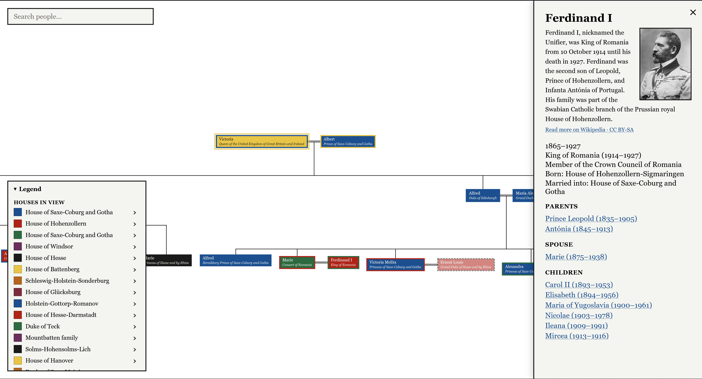

# European Dynasties

Interactive family trees of Europe's royal, imperial and noble houses from the 10th century onward. Follow marriages and descendants across dynasties, see who was born into which house and who married into it, and read each person's biography - all built on open data from Wikidata and Wikipedia.

XOXO Gossip Girl

**Live site:** https://awesomelena.github.io/european-dynasties/



## Features

- **Around 13,000 people from 60+ dynasties** - the great powers, the Balkans, Scandinavia and the Low Countries, from the Capetians and Rurikids to the Windsors and Karađorđevićs, including Byzantium.
- **Start page by country.** Pick a country, then one of its dynasties, and the tree opens at that dynasty's first ruler.
- **Genealogy-specific layout.** A custom layout algorithm guarantees the rules family trees need: spouses stand next to each other, children are grouped by marriage and ordered by birth, and a child is always drawn below its parents.
- **Multiple marriages.** Everyone's spouses are shown, in order of marriage. Divorces and annulments are drawn as dashed lines.
- **Time axis.** Vertical position follows year of birth. Missing birth years are estimated from relatives and marked as *c. 1045*.
- **Neighbourhood view.** The tree shows the surroundings of the focused person - parents, siblings, children and grandchildren. Click anyone to walk up or down the family.
- **Links to people.** The address follows the focused person, so any view can be shared as a link, and the browser's back button works as expected.
- **Houses in colour.** Fill shows the house a person was born into, border the house they married into. Colours are assigned per view, and the legend explains them.
- **Cousin marriages without clutter.** When a spouse already appears elsewhere in the tree, a faded, dashed copy is shown next to their partner instead of a long line across the tree.
- **Search** by name or title, accent-insensitive, with keyboard navigation.
- **House highlighting** and full member lists for every house.
- **Biographies** with an introduction and a pixelated portrait from Wikipedia, titles with dates, and parents, spouses and children as links.
- **Heraldic pixel style** - pixel fonts, the colours of heraldry, hard shadows.
- **Zoom and pan** with the mouse wheel, trackpad pinch, touch gestures, or on-screen buttons.

## How it works

The site is fully static - there is no backend. Data is prepared ahead of time and shipped as a single JSON file (about 2.6 MB, under 500 KB compressed).

```
scripts/seeds.json        dynasties and titles to start from
      │  npm run fetch:europe
      ▼
Wikidata (SPARQL)         responses cached in scripts/cache/
      │
      ▼
scripts/raw/europe.json   raw data, stored as received
      │  npm run transform     (+ scripts/countries.json)
      ▼
public/data/europe.json   clean dataset the site loads
      │
      ▼
browser: layout → SVG rendering
```

**Fetching** starts from the members of chosen houses and the holders of chosen titles, then follows one step of family relations (parents, children, spouses). Every Wikidata response is cached on disk, so an interrupted run resumes where it stopped.

**Transforming** is where all interpretation happens. Changing a rule only requires re-running the transform, not downloading everything again. Rules include:

- **House of birth** is the house a person shares with their father; Wikidata often lists several.
- **House by marriage** is derived from the spouse's house of birth.
- **Houses with identical names** are merged, since Wikidata sometimes keeps separate entries for branches of the same dynasty.
- **Missing birth years** are estimated from a spouse, the eldest child, a parent, or - as a last resort - the year of death.
- **Names and titles** are split from Wikidata labels ("Prince Arthur, Duke of Connaught" → *Arthur* / *Duke of Connaught*).
- **The main title** is chosen by rank (sovereign → grand duke → duke/prince), then by total years held. Repeated terms of the same title are merged, and titles of secondary realms (such as Commonwealth realms) rank lower.

Wikipedia summaries are not stored; they are fetched in the browser when a biography is opened.

## Tech stack

- **TypeScript** - shared types between the site and the data scripts
- **Vite** - dev server and build
- **SVG** - rendering, without a UI framework
- **d3-zoom** - zoom and pan gestures
- **tsx** - running the TypeScript data scripts in Node
- **Fontsource** - self-hosted pixel fonts (Silkscreen, Pixelify Sans)
- **GitHub Actions + GitHub Pages** - automatic build and deploy on every push to `main`

## Project structure

```
├── public/data/            dataset loaded by the site
├── scripts/
│   ├── seeds.json          houses and titles the data starts from
│   ├── countries.json      countries shown on the start page
│   ├── wikidata.ts         Wikidata queries, with caching and retries
│   ├── fetch-europe.ts     downloads raw data
│   ├── transform.ts        turns raw data into the site's dataset
│   └── raw/                raw Wikidata data
└── src/
    ├── main.ts             entry point: wiring, navigation, rendering
    ├── types.ts            data model shared with the scripts
    ├── constants.ts        sizes, fonts, palette
    ├── data/               loading and family lookups
    ├── layout/             the family-tree layout algorithm
    ├── render/             people, lines, colours, tooltip
    ├── ui/                 start page, search, legend, menu, side panel
    └── styles/             CSS, with heraldic colour tokens in tokens.css
```

## Getting started

Requires Node.js (LTS).

```bash
npm install
npm run dev
```

Then open http://localhost:5173/european-dynasties/

## Scripts

| Command | What it does |
|---|---|
| `npm run dev` | Start the development server |
| `npm run build` | Type-check and build the site into `dist/` (the same check CI runs) |
| `npm run preview` | Serve the production build locally |
| `npm run fetch:europe` | Download raw data from Wikidata (resumable, takes 15-30 minutes the first time) |
| `npm run transform` | Rebuild `public/data/europe.json` from the raw data |

## Data and licensing

- Genealogical data comes from **[Wikidata](https://www.wikidata.org/)**, available under CC0.
- Biographies and portraits come from **[Wikipedia](https://en.wikipedia.org/)** and are shown under CC BY-SA, with a link to the source article.
- Much of the structure (houses, main titles, estimated years) is inferred by rules, so some entries will be imperfect. Corrections to the underlying facts are best made on Wikidata itself.

## Roadmap

Planned work is tracked in [Issues](https://github.com/awesomelena/european-dynasties/issues).

## License

The code is released under the [MIT License](LICENSE). This applies to the source code only - data from Wikidata and text from Wikipedia keep their own licenses, described above.